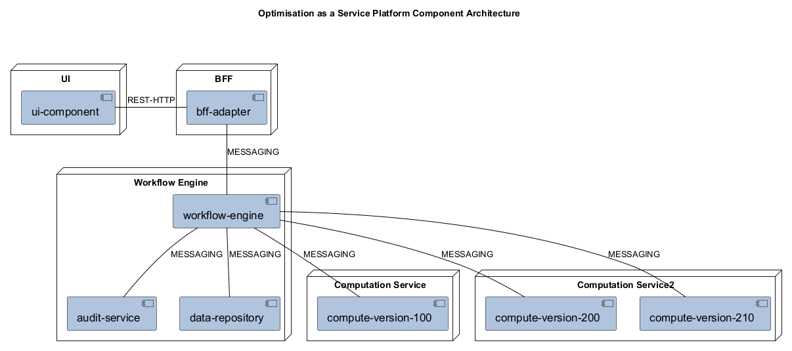
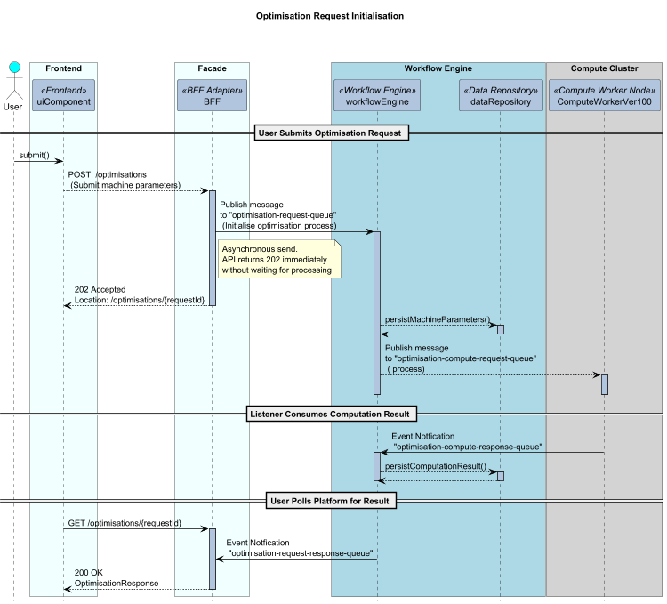
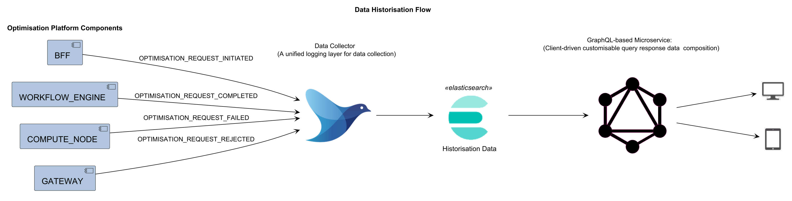
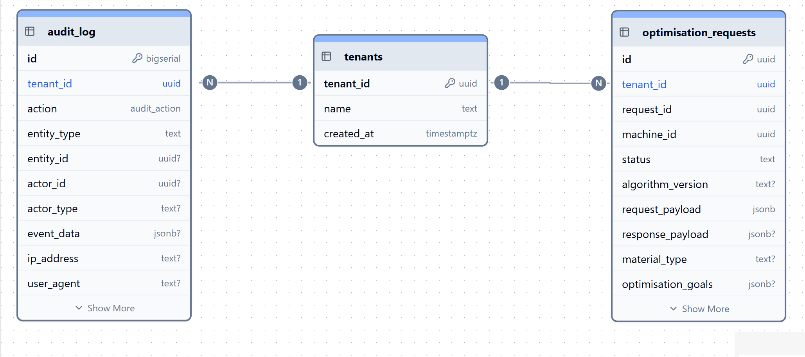

# Solution Architecture

## Table of Contents

1. Business Case
2. Requirements Summary
3. Solution Architecture Overview
4. High-Level Solution Design
5. Integration Architecture
6. Data Architecture
7. Security Architecture
8. Non-Functional Requirements

## 1. Business Case

1. A need to eliminate time intensive and error-prone machine optimisation configuration processes.
2. A need for scalable software-based optimisation processes that can serve a growing user base 

## 2. Requirements Summary

1. Auditability
2. Extensibility
3. Scalability
4. Evolvabiity

## 3. Solution Architecture Overview

## 4. High-Level Solution Design

### Data Flow

- Describe the architecture in detail, including information on system modules and components.
- Include detailed architectural diagrams.

### Data Historisation

## 5. Integration Architecture

- API-driven integration
- Messaging backbone for event-driven architecture

## 6. Data Architecture

1. Multi-tenant aware data modelling
2. PostgresQL Database
   - Support for structured and unstructured data
   - Transactional Data (ACID) and Eventually Consistent Data (BASE)

## 9. Security Architecture

1. OpenID Connect standard - backed by identity provider and JWT token.
2. RBAC, ABAC supported by claims and policies validated via Client Credential Flows & Authorisation Code Flows

## 11. Non-Functional Requirements

- Describe the requirements for performance, scalability, reliability, and availability.
